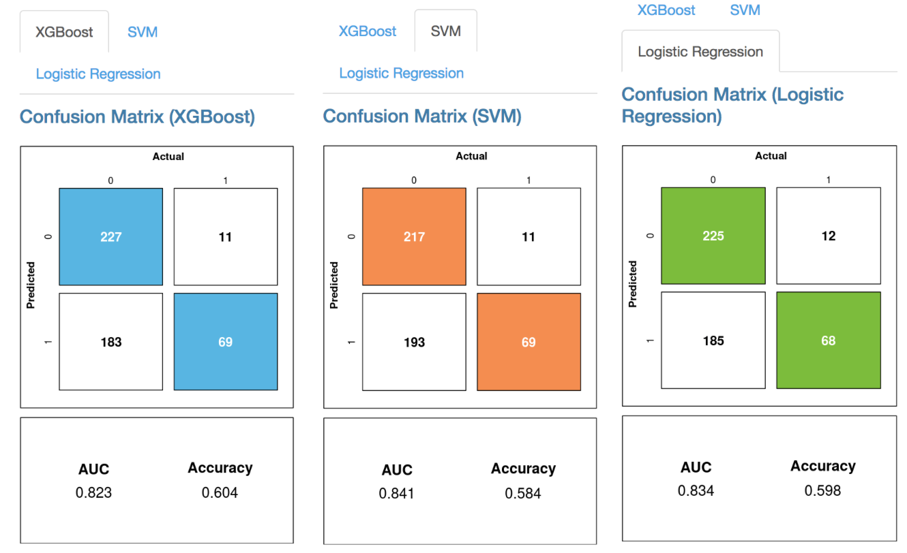

# Part 3: Model evaluation and features discussion

In this part, we use the results from our pre-trained models in part2 to do some model evalutions. We will use several machine learning criterions here such as receiver operating characteristic(roc) curve, precision and recall curve, etc. All of them are calculated bases on the predicted attrition class and the true attrition class in the testing dataset. 

```{r}
# load the previous workspace in part2
load("part2.RData")
```

```{r,message=FALSE, warning=FALSE}
# load packages
library("ggplot2")
library("corrplot")
library("ROCR")
library("caret")

```


## Fine-Tuning the Results

Remeber that each algorithm gives a confidence score(probability) between 0 and 1 for each employee, indicating that the model thinks these individuals are somewhere between 0% and 100% likely to attrite, respectively. By setting the confidence score threshold, above which we predict an employee to leave, we end up with a control on the precision and recall statistics; the cutoff can be adjusted in real-time to optimize the model based on the needs of the business. 

In a true analysis, these algorithms would be further tuned and potentially ensembled to provide the most accurate prediction of employee attrition possible. For now, they can be compared using the graphical plots in the app.

Firstly, let us creat a simple prediction object and use them to create roc data. Each roc dataset should contain the values for false positive rate, true positive rate and correspond model names.\

```{r}
# Creat a prediction object using previously saved results
ROCRpred_xgb <- prediction(pred.xgb, test_Y)
ROCRpred_svm <- prediction(svm_model.prob[,2], test_Y)
ROCRpred_lr <- prediction(LR_model.predict, test_Y)


#XGBoost roc data
perf_xgb <- performance(ROCRpred_xgb, 'tpr','fpr')					
roc_xgb.data <- data.frame(fpr=unlist(perf_xgb@x.values),
                tpr=unlist(perf_xgb@y.values), model="XGBoost")
					
#SVM roc data
perf_svm <- performance(ROCRpred_svm, 'tpr','fpr')					
roc_svm.data <- data.frame(fpr=unlist(perf_svm@x.values),
                tpr=unlist(perf_svm@y.values), model="SVM")
					
#Logistic Regression roc data
perf_lr <- performance(ROCRpred_lr, 'tpr','fpr')					
roc_lr.data <- data.frame(fpr=unlist(perf_lr@x.values),
               tpr=unlist(perf_lr@y.values), model="LR")
```

Everything is set up and we could draw an awesome roc plot now.

```{r, fig.align='center', fig,width = 6, fig.height= 4,fig.cap="Receiver operating characteristic (ROC) curve. The closer the ROC curve is to the top left corner, the greater the accuracy of the test. \\label{fig:roccurve}"}

# Define colors for roc plot
cols <- c("XGBoost" = "#3DB7E4", "SVM" = "#FF8849", "Logistic Regression" = "#69BE28")

# Creat roc plot
ggplot() + 
geom_line(data = roc_xgb.data, aes(x=fpr, y=tpr, colour = "XGBoost")) + #set XGBoost roc curve
geom_line(data = roc_svm.data, aes(x = fpr, y=tpr, colour = "SVM")) + #set SVM roc curve
geom_line(data = roc_lr.data, aes(x = fpr, y=tpr, colour = "Logistic Regression")) + 
#set LR roc curve
geom_vline(xintercept = 0.5, color = "red", linetype=2) + theme_bw() + #set themes
scale_colour_manual(name = "Models", values = cols) + 
xlab("False Positive Rate") +
ylab("True Positive Rate") +
theme(legend.position = c(0.8, 0.2), 
legend.text = element_text(size = 15), 
legend.title = element_text(size = 15))
```

Figure \ref{fig:roccurve} shows the ROC curve. This is the result of plotting the true positive rate against the false positive rate. The figure shows a relatively good balance of the trade-off, with all three models performing equally well. 
 
We will add a slider to adjust the vertical red line in the Shiny app. The slider allows the user to change the operation point of the algorithm by setting the false positive rate. The changes made to this cut-off are reflected in the confusion matrices shown (Figure \ref{fig:confmatrices}), where each confusion matrix shows the performance of the predictions of the various algorithms with respect to the true label. XGBoost has the highest accuracy, with the lowest false positive and false negative rates.

Here is the logic and code how we draw the confusion matrix:

  1. Obtain the auc, fpr and tpr using \emph{\textbf{performance}} function  \
  2. Define a function to obtain the cutoff probability given a fixed fpr. 
     Any predicted probability that is greater than the cutoff will be classified 
     as attrition and vise versa. That is to say, if fpr = 0.5 is chosen, the 
     cutoff probability will result in a fpr which is at most 0.5.  \
  3. Define a function to draw a confusion matrix plot given calculated confusion
     table, auc and chosen color. \
  4. Take a look of three confusion matrices from three models and compare their auc,
     fpr,tpr and accuracy.\

```{r, fig.show= "hide"}
# Define a function to obtain the cutoff probability
# @perf is a S4 object gotten from @performance function
# @threshold is the targeted fpr
# In the ShinyApp, users can adjust the threshold by themselves and
# obtain different confusion matrix accordingly. Here, we always set
# threshold = 0.5 just for illustration.
get_cutoff_point <- function(perf, threshold)
  {
	cutoffs <- data.frame(cut=perf@alpha.values[[1]], fpr=perf@x.values[[1]], tpr=perf@y.values[[1]])
	cutoffs <- cutoffs[order(cutoffs$tpr, decreasing=TRUE),]
	cutoffs <- subset(cutoffs, fpr <= threshold)
	if(nrow(cutoffs) == 0){ return(1.0)}
	else return(cutoffs[1, 1])
}

# Define a function to draw a confusion matrix plot
# @cm is a confusion matrix obtained from @confusionMatrix function
# @auc is the auc value obtained from @performance function
# @color is the kind of color you want for true positive and true negative areas
# In this function, we also add in accuracy information which calculates the
# overall performance of model
draw_confusion_matrix <- function(cm, auc, color) {

  layout(matrix(c(1,1,2)))
  par(mar=c(0,0.1,1,0.1))
  plot(c(125, 345), c(300, 450), type = "n", xlab="", ylab="", xaxt='n', yaxt='n')

  # create the matrix 
  rect(150, 430, 240, 370, col=color)
  text(195, 435, '0', cex=1.2)
  rect(250, 430, 340, 370, col='white')
  text(295, 435, '1', cex=1.2)
  text(125, 370, 'Predicted', cex=1.3, srt=90, font=2)
  text(245, 450, 'Actual', cex=1.3, font=2)
  rect(150, 305, 240, 365, col='white')
  rect(250, 305, 340, 365, col=color)
  text(140, 400, '0', cex=1.2, srt=90)
  text(140, 335, '1', cex=1.2, srt=90)

  # add in the cm results 
  res <- as.numeric(cm$table)
  text(195, 400, res[1], cex=1.6, font=2, col='white')
  text(195, 335, res[2], cex=1.6, font=2, col='black')
  text(295, 400, res[3], cex=1.6, font=2, col='black')
  text(295, 335, res[4], cex=1.6, font=2, col='white')

  # add in the specifics 
  plot(c(0, 100), c(0, 50), type = "n", xlab="", ylab="", main = "", xaxt='n', yaxt='n')

  # add in the accuracy information 

  text(25, 30, "AUC", cex=1.8, font=2)
  text(25, 20, round(as.numeric(auc), 3), cex=1.8)
  text(75, 30, names(cm$overall[1]), cex=1.8, font=2)
  text(75, 20, round(as.numeric(cm$overall[1]), 3), cex=1.8)
}

# draw XGBoosting confusion matrix 
auc_xgb <- performance(ROCRpred_xgb, measure = "auc")  #obtain auc from @performance
perf_xgb <- performance(ROCRpred_xgb, 'tpr','fpr')  #obtain tpr and fpr from @performance					
cut <- get_cutoff_point(perf_xgb, 1) #obtain the cutoff probability
pred_values_xgb <- ifelse(pred.xgb > cut,1,0) #classify using cutoff probability
cm_xgb <- confusionMatrix(data = pred_values_xgb, reference = test_Y) #obtain confusion matrix
draw_confusion_matrix(cm_xgb, auc_xgb@y.values, "#3DB7E4")  #Draw confusion matrix plot

# draw SVM confusion matrix
auc_svm <- performance(ROCRpred_svm, measure = "auc")
perf_svm <- performance(ROCRpred_svm, 'tpr','fpr')					
cut <- get_cutoff_point(perf_svm, 0.5)
pred_values_svm <- ifelse(svm_model.prob[,2] > cut,1,0)
cm_svm <- confusionMatrix(data = pred_values_svm, reference = test_Y)
draw_confusion_matrix(cm_svm, auc_svm@y.values, "#FF8849")

# draw Logistic regression confusion matrix
auc_lr <- performance(ROCRpred_lr, measure = "auc")
perf_lr <- performance(ROCRpred_lr, 'tpr','fpr')					
cut <- get_cutoff_point(perf_lr, 0.5)
pred_values_lr <- ifelse(LR_model.predict > cut,1,0)
cm_lr <- confusionMatrix(data = pred_values_lr, reference = test_Y)
draw_confusion_matrix(cm_lr, auc_lr@y.values, "#69BE28")
```

```{r,fig.align='center', echo=FALSE, out.width = "400px",fig.cap="Confusion Matrices for all three models. The numbers in each of the bins indicate the number of True Negatives (0,0) i.e. retained employees, False Negatives (0,1), False Positives (1,0) and True Positives (1,1). \\label{fig:confmatrices}"}

```


## Precision, Recall, and $F_1$ Scores
Another way to visualise this result is to look at precision and recall. Precision is positive predictive value which is the precentage of true positive divided by predicted condition positive, recall is true positive rate which is the percentage of true positive divided by condition positive. These two statistics are important aspects of any classification model and are components of the overall F1 score which reaches its best value at 1 and worst at 0, given by:

$$
F_1 = 2 \cdot \frac{1}{\frac{1}{\text{recall}}+\frac{1}{\text{precision}}} = 2 \cdot \frac{\text{precision}\cdot\text{recall}}{\text{precision}+\text{recall}}
$$

An ideal model has both high precision and recall;  in general, this is difficult to achieve and instead we can choose to change the cutoff point directly to trade some precision for recall and vice-versa. In brief, a precision is the probability that a predicted attrition is a real attrition and a recall is the probability that a real attrition is predicted as attrition in our analysis. By controlling the tradeoff between False Positives and False Negatives, businesses can determine where they would like to skew their analysis towards. The codes drawing the precision plot and recall plot are pretty much similar to the codes for drawing a roc. What we need to adjust is just the measurement parameter in the \emph{\textbf{performance}} function. By controlling the cutoff, we can compare precision and recall values among different models in this plot. The codes are shown as below: \

```{r,fig.align='center', fig.width= 7, fig.height=4, warning=FALSE, fig.cap="Shows the tradeoff between precision as you increase the cut-off. \\label{fig:preccurve}"}
#Creat precision plot
#XGBoost
perf_xgb <- performance(ROCRpred_xgb,'prec', 'cutoff') #use 'prec' and 'cutoff' as measurements					
xgb.data <- data.frame(x=unlist(perf_xgb@x.values), y=unlist(perf_xgb@y.values),
            model="XGBoost")
					
#SVM
perf_svm <- performance(ROCRpred_svm,'prec', 'cutoff')					
svm.data <- data.frame(x=unlist(perf_svm@x.values), y=unlist(perf_svm@y.values), 
            model="SVM")
					
#Logistic Regression
perf_lr <- performance(ROCRpred_lr,'prec', 'cutoff')					
lr.data <- data.frame(x=unlist(perf_lr@x.values), y=unlist(perf_lr@y.values),
           model="LR")
					

cols <- c("XGBoost" = "#3DB7E4", "SVM" = "#FF8849", "Logistic Regression" = "#69BE28")
					
ggplot() +
geom_line(data = xgb.data, aes(x=x, y=y, colour = "XGBoost")) + 
geom_line(data = svm.data, aes(x =x, y=y, colour = "SVM")) + 
geom_line(data = lr.data, aes(x =x, y=y, colour = "Logistic Regression")) + 
scale_colour_manual(name = "Models", values = cols) + 
xlab("Cutoff") +
ylab("Precision") +
geom_vline(xintercept = 0.5, color = "red", linetype=2) + theme_bw() +
theme(legend.position = c(0.8, 0.2), 
legend.text = element_text(size = 15), 
legend.title = element_text(size = 15))

```

```{r, fig.align='center', fig.width=7,fig.height=4,fig.cap="Shows the tradeoff between recall as you increase the cut-off. \\label{fig:recallcurve}"} 
#Creat recall plot
#XGBoost
perf_xgb <- performance(ROCRpred_xgb,'rec', 'cutoff')					
xgb.data <- data.frame(x=unlist(perf_xgb@x.values), y=unlist(perf_xgb@y.values), model="XGBoost")
					
#SVM
perf_svm <- performance(ROCRpred_svm,'rec', 'cutoff')					
svm.data <- data.frame(x=unlist(perf_svm@x.values), y=unlist(perf_svm@y.values), model="SVM")
					
#Logistic Regression
perf_lr <- performance(ROCRpred_lr,'rec', 'cutoff')					
lr.data <- data.frame(x=unlist(perf_lr@x.values), y=unlist(perf_lr@y.values), model="LR")

cols <- c("XGBoost" = "#3DB7E4", "SVM" = "#FF8849", "Logistic Regression" = "#69BE28")

ggplot() +
geom_line(data = xgb.data, aes(x=x, y=y, colour = "XGBoost")) + 
geom_line(data = svm.data, aes(x=x, y=y, colour = "SVM")) + 
geom_line(data = lr.data, aes(x=x, y=y, colour = "Logistic Regression")) + 
scale_colour_manual(name = "Models", values = cols) + 
xlab("Cutoff") +
ylab("Recall") +
geom_vline(xintercept = 0.5, color = "red", linetype=2) + theme_bw() +
theme(legend.position = c(0.8, 0.8), 
legend.text = element_text(size = 15), 
legend.title = element_text(size = 15))

```

Figure \ref{fig:preccurve} shows the Precision curves for the three models and how the cut-off will affect the precision.  Figure \ref{fig:recallcurve} shows the Recall curves for the thre models and how the cut-off will affect the recall. In this example, we use cutoff = 0.5 just for illustration and in our ShinyApp, user can adjust the cutoff slider by themselves. As with the ROC curve, we have provided confusion matrices for each algorithm so that the user can see the effect that changes in cutoff have on the final results. Consuquently, with different business objectives, the user can adjust the cutoff and check the model's performance accordingly. 

For example, in cases such as medicine where undiagnosed issues have much greater importance, we can skew the operation point to the left - where we find far fewer false negatives (but more false positive) instances. Conversely for businesses with very limited HR resources, it may be best to go for fewer false positives (to the right of the curve), rank the confidence scores given by the raw algorithm, and target only the highest risk employees with incentives. 

The confidence score can be combined with any HR metrics, which themselves can be modelled algorithmically if need-be, to give an expected value lost per individual. We can then use this to rank employees in terms value to the company that is likely to be lost. Ultimately this provides the threshold of spending power that HR departments should be given access to retain each specific employee.

To actively address overall employee retention issues, we need to look more closely at the most important features that determine the attrition probability and see if we can improve company retention.

## Remarks

We took a brief look at the model evaluations for three separate classifiers with different criterions. It appears that XGBoost currently is the best out of the box model, although in a full analysis, more fine-tuning of parameters and tests with ensembling would be performed. 

For more details on this or any potential analyses, please visit us at [(http://sflscientific.com](http://sflscientific.com) or contact mluk@sflscientific.com.