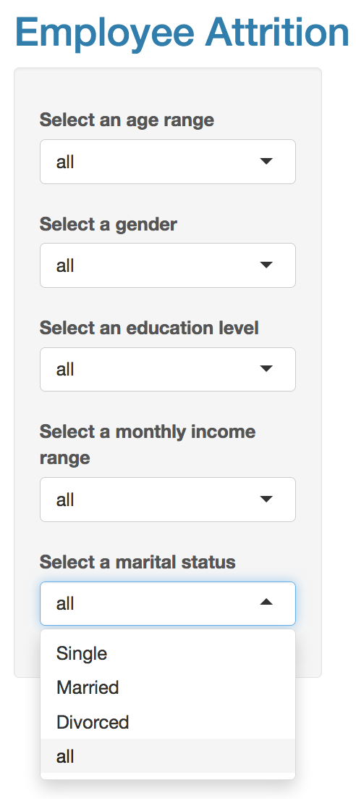
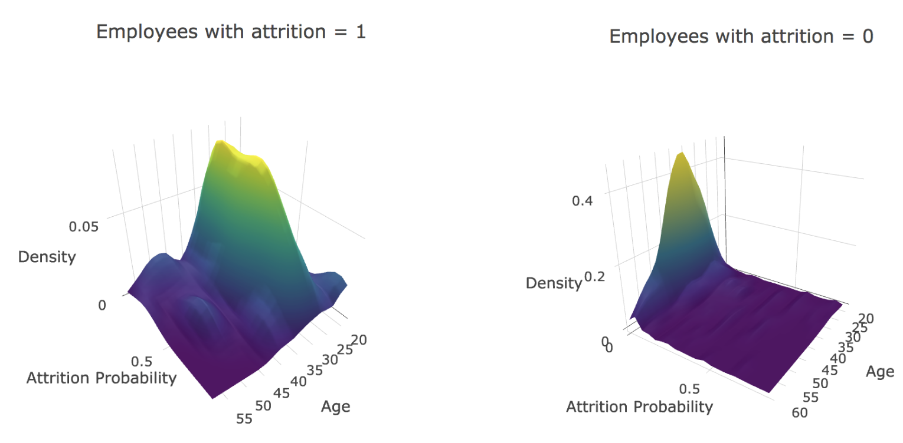
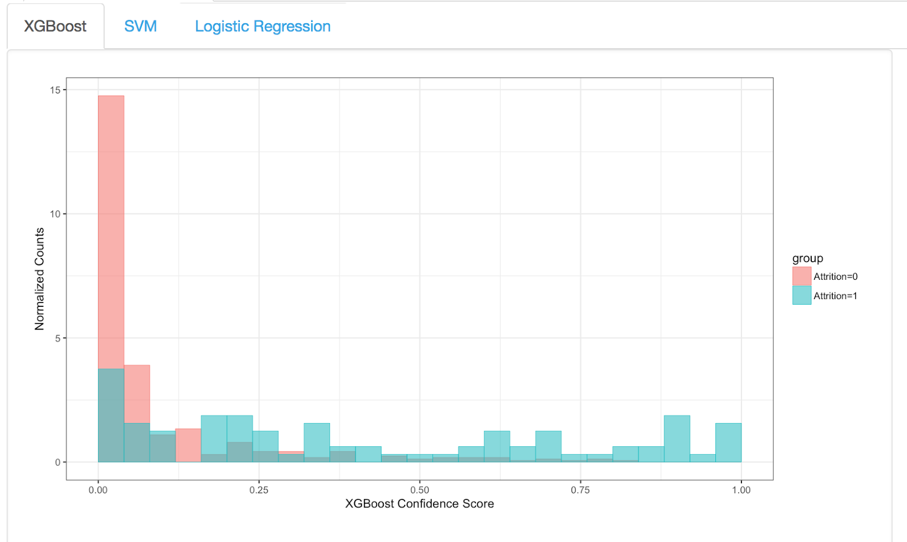

# Part 4: Construction of the R Shiny App

R Shiny is a powerful yet intuitive tool for creating interactive web applications in R. Part of its appeal comes from the fact that it handles the code conversion for you; instead of learning HTML, CSS and Javascript, all you need to know is R. These apps can perform any R calculation in the backend, meaning they are just as powerful as a program run on your desktop. Further, Shiny has many options for constructing a user interface that fit the requirements of any project.

The application itself has two main components: the user interface and the server. The user interface controls the appearance and layout of the app, including all the interactive sliders, text boxes and buttons. The server is responsible for performing the calculations and contains the instructions for building the app. 

## UI Code Snippet

The code snippet below shows how to set up a section of the user interface. In this case, we created a simple sidebar to allow the user to select from certain sub-groups of employees.

```{r, fig.cap="User interface code snippet. Shows the main setup for the left-hand-side user options. \\label{fig:shinyui}", eval=FALSE}

shinyUI(fluidPage(
    theme = shinytheme("cerulean"),
    column(width=12,
    titlePanel("Employee Attrition")),
    sidebarLayout(
        sidebarPanel(
            helpText("We recommend 3 or fewer options at a time."),
            width = 2,
            selectInput("Age", 
                        label = "Select an age range", 
                        choices = c("< 35", "35-45", "> 45", "all"), 
                        selected = "all"),
            selectInput("Gender", 
                        label = "Select a gender", 
                        choices = c("Female", "Male", "all"), 
                        selected = "all"), 
            selectInput("Education", 
                        label = "Select an education level",
                        choices = c("1", "2", "3", "4", "all"), selected = "all"),
            selectInput("MonthlyIncome", 
                        label = "Select a monthly income range", 
                        choices = c("< 2500", "2500-5000", "5001-7500", 
                                    "7501-10000", "> 10001", "all"), 
                        selected = "all"),
            selectInput("MaritalStatus", 
                        label = "Select a marital status", 
                        choices = c("Single", "Married", "Divorced", "all"),
                        selected = "all")
    	)
    	...
    )
```


## Server Code Snippet

On the server side, the options from the side bar are stored in variables which can then be applied to the model. The code for the server is setup very simply in a similar manner with reactive switches. 

```{r, fig.cap="Shows the server side code snipped. \\label{fig:server}", eval=FALSE}

ageRange <- reactive({switch(input$Age, 
               		"< 35" = c(0, 35),
               		"35-45" = c(35, 46),
               		"> 45" = c(46, 1000),
               		"all" = c(0, 1000)           		
               		) })
 	gender <- reactive({switch(input$Gender, 
               		"Male" = 2,
               		"Female" = 1,
               		"all" = 0             		
               		) })
  	MonthlyIncome <- reactive({switch(input$MonthlyIncome, 
               		"< 2500" = c(0, 2500),
               		"2500-5000" = c(2500, 5001),
               		"5001-7500" = c(5001, 7501),
               		"7501-10000" = c(7501, 10001),
               		"> 10001" = c(10001, 1000000),
               		"all" = c(0, 1000000)                		
               		) })
     MaritalStatus <- reactive({switch(input$MaritalStatus, 
               		"Divorced" = 1,
               		"Married" = 2,
               		"Single" = 3,
               		"all" = 0             		
               		) })
```
The two work as a cohesive unit, with the user interface receiving the changes from the user and passing them along to the server to execute.

The level of interactivity of a Shiny app can vary based on the scope of the project and the developer's needs. When dealing with employee attrition in particular, it is useful to look at specific employees and thus we added several options to allow the user to subset out such groupings.

## UI

When run the UI options that appear are shown in Figure \ref{fig:labels}.

```{r, fig.align='center', echo=FALSE, out.width = "150px",fig.cap=" Options to subset groups of employees. \\label{fig:labels}"} 

```

\underline{NB}: We limited the subsetting options to five factors: age, gender, education level, monthly income and marital status. The size of the dataset should be taken into account when deciding how many options to provide the user. Certain algorithms need a certain amount of data in order to properly run, and unless the user knows exactly how much data is in each subset, there are likely to be errors. Even within our application, we do not recommend subsetting the data by more than 3 options as plots will become unpopulated. Developers can find workarounds for this issue, for example, by dynamically limiting the options for the user or displaying different plots if necessary.


## Density Plot

As previously demonstrated in the algorithms section, the user is able adjust the false positive rate along with the cutoffs for precision and recall. All of these options depend on the current needs of the business and it is for that reason that they appear as a choice. Most of the work goes on behind the scenes with the modeling and calculations done in R. However, having a variety of options in these applications is incredibly important for representing every possible need that might arise.

To create the density plot, we can simply use plotly, specify the dataset variables, and make the plot. 
```{r, fig.cap="Density plot code snippet. \\label{fig:densitycode}", eval=FALSE}
output$prob_xgb_0 <- renderPlotly({ 
                                  plot_ly(x = xgb_0_kde()$y, 
                                          y = xgb_0_kde()$x,  
                                          z = xgb_0_kde()$z, 
                                          showscale=FALSE, size = 0.1) %>% 
                                  add_surface() %>% 
                                  layout(
                                      title = "Employees with attrition = 0",
                                      scene = list(
                                          xaxis = list(title = xgb_featureName()),
                                          yaxis = list(title = "Attrition Probability"),
                                          zaxis = list(title = "Density"),
                                          camera = camera
                                      ),
                                      margin = list(l = 0, r = 0, b = 25, t = 50, pad = 4)
                                    )
  }) 
  ... same for Attrition = 1
```

The result is show in Figure \ref{fig:densityplot} for the variable Age. From here, you can see that the majority of employees that to attrite, are on the younger side of age. Further, for employees that stay (the RHS plot), the predicted probability of attrition is always low. This indicates that the model is doing pretty well at correctly labelling True Positives for all age ranges. 
```{r, fig.align='center', echo=FALSE, out.width = "400px",fig.cap=" Interactive density distributions for Age and Model Predicted Attrition Probability separarted by True Label.  \\label{fig:densityplot}"} 

```


To validate the prediction on a hold out set, we can also look at the final probability output from each of three classifiers. The histogram shows the confidence scores separated by the true attrition class. This plot shows that those that stay at the company (attrition group = 0) are well classified by our simple algorithm, typically having scores below 0.20. In contrast, many of those who have actually left the company (attrition group = 1) have scores above 0.20.  The code snippet to do this is shown below:
```{r, fig.cap="Histogram probability snippet. \\label{fig:histogramprob}", eval=FALSE}
tabPanel("Explanation of Results",
         fluidRow(column(width=12),
                  tabsetPanel(
                    tabPanel("XGBoost", 
                             column(width = 10, class="well", plotOutput("hist_plot_xgb"),
                             div(style = "height:110px;background-color: white;"),
                             final_explanation_1, 
                             final_explanation_2, 
                             final_explanation_3,
                             final_explanation_4,
                             style = "background-color:white;"
                        )
                    ),
                    ... 
                    similar for SVM and Logisitc regression 
                    ...
         )        
  )
```

Which gives the plot shown in Figure \ref{fig:histogram}. Overall, we see that the algorithm is doing quite well. There is decent separation between those that Attrite and those that Remain, with higher probabilities generally being assinged to employees who leave the company.

```{r, fig.align='center', echo=FALSE, out.width = "400px",fig.cap="Shows the model predicted attrition probability for XGBoost. The colours indicate the true attrition value (Pink: employees that remain, Blue: employees that attrite). \\label{fig:histogram}"} 

```

Notice that due to the overlap of these two histograms, there will  be some False Positives and/or False Negatives; the quantity of which is again tuneable through the cutoff we discussed earlier. From here, you can see that there is still significant potential for algorithm improvement that can be made by developing our methods beyond this toy analysis.


## Remarks

Over the course of the three blog posts, we have looked over one example of where RShiny can be combined with Machine Learning to give a powerful and intuitive look into how employee attrition can be modelled. Once the RShiny platform is hooked up to the underlying machine learning models, an HR department can be set up to use the app interactively, to export and target individual and high priority employees. These types of models which can be maintained with live data can be used as a dashboard to monitor overall employee well-being and can provide just the first piece of an HR departments analytics.

This analysis is particularly useful if a company wants to lower attrition levels but is unsure of the source of the problem. Conversely, if a company needs to decrease their labor costs and headcounts, then understanding employee attrition can ease the transition by preparing affected groups to lose personnel. 

For more details on this or any potential analyses, please visit us at [(http://sflscientific.com](http://sflscientific.com) or contact mluk@sflscientific.com.
